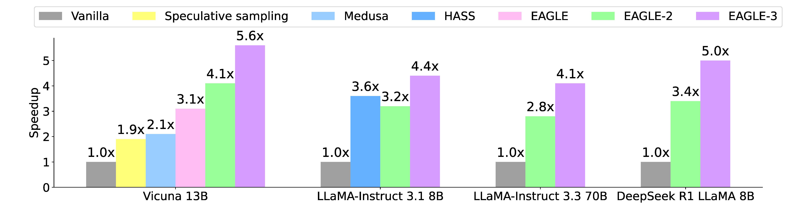

<!-- markdownlint-disable MD001 MD033 MD041 -->

<p align="center">
  <picture>
    <source media="(prefers-color-scheme: dark)" srcset="assets/eagle-logo-landscape-black.png">
    
  </picture>
</p>

<h3 align="center">Speculative decoding for faster, lossless LLM generation</h3>

<p align="center">
| <a href="https://arxiv.org/pdf/2401.15077.pdf"><b>EAGLE Paper</b></a> |
<a href="https://arxiv.org/pdf/2406.16858"><b>EAGLE-2 Paper</b></a> |
<a href="https://arxiv.org/pdf/2503.01840"><b>EAGLE-3 Paper</b></a> |
<a href="https://lightseek.org/blog/eagle-3-1.html"><b>EAGLE 3.1 Blog</b></a> |
<a href="https://sites.google.com/view/eagle-llm"><b>Project Blog</b></a> |
</p>

<p align="center">
  <a href="">
    
  </a>
  <a href="https://opensource.org/licenses/Apache-2.0">
    
  </a>
  <a href="https://github.com/SafeAILab/EAGLE/issues">
    
  </a>
  <a href="https://github.com/SafeAILab/EAGLE/pulls">
    
  </a>
</p>

---

*News*

- **2026.5.26**: [EAGLE 3.1](https://lightseek.org/blog/eagle-3-1.html) is introduced with the vLLM and TorchSpec teams, improving speculative decoding stability across long context, chat-template variation, and production serving.
- **2026.5.26**: EAGLE 3.1 support is available in [vLLM](https://github.com/vllm-project/vllm/pull/42764) with FC normalization, post-norm hidden-state feedback, and config-driven compatibility with EAGLE-3.
- **2026.5.26**: [TorchSpec](https://github.com/lightseekorg/torchspec) adds EAGLE 3.1 training support, and an EAGLE 3.1 draft model is released for [Kimi K2.6](https://huggingface.co/lightseekorg/kimi-k2.6-eagle3.1-mla).
- **2025.9.18**: EAGLE-3 is accepted to NeurIPS 2025.
- **2025.7.23**: [SpecForge](https://github.com/sgl-project/SpecForge) is strongly recommended for out-of-the-box EAGLE-3 training with SGLang.
- **2025.3.19**: EAGLE-3 is released.

---

## Introduction

EAGLE, short for **Extrapolation Algorithm for Greater Language-model Efficiency**, is a family of speculative decoding algorithms for accelerating Large Language Model inference while preserving the output distribution of vanilla decoding.

The core idea is to use a lightweight draft module to propose future tokens, verify those tokens with the target LLM, and accept the longest valid prefix. This turns sequential autoregressive decoding into a more parallel process without changing the target model's final distribution.

<p align="center">
  
</p>

EAGLE has become one of the most widely adopted speculative decoding methods across research and production systems.

- EAGLE-1 extrapolates second-top-layer contextual features and achieves strong speedups while provably maintaining consistency with vanilla decoding.
- EAGLE-2 dynamically adjusts draft trees using draft-model confidence scores to better approximate acceptance rates.
- EAGLE-3 removes the feature-prediction constraint, uses training-time testing, and fuses low-, mid-, and high-level semantic features for stronger acceleration.
- EAGLE 3.1 improves stability and deployability by addressing attention drift during deeper speculation.

<p align="center">
  
</p>

*The demo inference is conducted on 2x RTX 3090 GPUs at fp16 precision using Vicuna 13B.*

## Why EAGLE

EAGLE is designed for practical inference acceleration:

- **Lossless speculative decoding**: maintains the target model's generation distribution under the standard acceptance rule.
- **Strong speedups**: EAGLE-3 reaches up to **5.6x** speedup over vanilla decoding on 13B models in the reported setting.
- **Production adoption**: integrated into major serving systems including vLLM, SGLang, TensorRT-LLM, AMD ROCm, NVIDIA NeMo, PaddleNLP, and more.
- **Trainable draft modules**: EAGLE draft models can be trained with commodity multi-GPU setups, and EAGLE-3 training is supported through this repository and SpecForge.
- **Composable with system optimizations**: works alongside serving frameworks, quantization, optimized attention kernels, hardware acceleration, and distributed inference.

## EAGLE 3.1

EAGLE 3.1 is a stability and deployment upgrade to EAGLE-3, introduced jointly by the EAGLE team, vLLM team, and TorchSpec team.

In real serving environments, speculative decoding can become fragile when prompts differ from the training setup, especially with long contexts, custom chat templates, or out-of-distribution system prompts. This behavior is traced to **attention drift**: as speculation depth increases, the drafter shifts attention away from sink tokens and toward tokens it generated itself.

<p align="center">
  
</p>

EAGLE 3.1 introduces two architectural changes:

- **FC normalization** after each target hidden state and before the FC layer.
- **Post-norm hidden-state feedback** into the next decoding step.

These changes make deeper speculation more stable and improve the match between training-time behavior and inference-time behavior. In long-context workloads, EAGLE 3.1 achieves up to **2x longer acceptance length** compared with EAGLE-3.

EAGLE 3.1 improves:

- long-context stability;
- resilience to chat-template and system-prompt variation;
- training-time to inference-time extrapolation;
- stable acceptance length across diverse serving environments.

### Training and Serving

[TorchSpec](https://github.com/lightseekorg/torchspec) provides efficient EAGLE 3.1 training support for rapid experimentation with speculative decoding algorithms. An EAGLE 3.1 draft model is also available for Kimi K2.6:

| Base Model | EAGLE 3.1 Draft Model | Notes |
|-----------|------------------------|-------|
| Kimi K2.6 | [lightseekorg/kimi-k2.6-eagle3.1-mla](https://huggingface.co/lightseekorg/kimi-k2.6-eagle3.1-mla) | Trained with TorchSpec and deployable with vLLM |

EAGLE 3.1 is integrated into [vLLM](https://github.com/vllm-project/vllm) as a config-driven extension of the existing EAGLE-3 path. The integration adds FC normalization, post-norm feedback, and removes hardcoded assumptions around target hidden states while preserving backward compatibility with existing EAGLE-3 checkpoints.

<p align="center">
  
</p>

## EAGLE-4

EAGLE-4 is under active development. The direction is to push speculative decoding beyond single-algorithm speedups toward a more adaptive, serving-aware acceleration stack.

Areas of focus include:

- stronger stability under long-context and multi-turn workloads;
- better draft-model behavior across model families and deployment templates;
- tighter integration with production serving engines;
- simpler training and release workflows for official draft checkpoints;
- broader support for frontier dense, MoE, MLA, and hybrid architectures.

More details will be announced when the design and benchmarks are ready.

## Contents

- [Introduction](#introduction)
- [Why EAGLE](#why-eagle)
- [EAGLE 3.1](#eagle-31)
- [EAGLE-4](#eagle-4)
- [Installation](#installation)
- [Model Weights](#model-weights)
  - [EAGLE-3 Models](#eagle-3-models)
  - [EAGLE Models](#eagle-models)
- [Inference](#inference)
  - [With UI](#with-ui)
  - [With Code](#with-code)
- [Training](#training)
- [Evaluation](#evaluation)
- [Ecosystem Support](#ecosystem-support)
- [Roadmap](#roadmap)
- [Citation](#citation)
- [Acknowledgements](#acknowledgements)

## Installation

```bash
git clone https://github.com/SafeAILab/EAGLE.git
cd EAGLE
python -m venv ~/venvs/ea_env
source ~/venvs/ea_env/bin/activate
pip install -r requirements.txt
```

The default `main` branch contains the implementation of EAGLE-3 and EAGLE-2. To use EAGLE-1, switch to the `v1` branch.

## Model Weights

### EAGLE-3 Models

*Note:* This repository recognizes only official EAGLE-3 checkpoints. Performance of unofficial checkpoints may vary. If you compare against EAGLE-3, please compare with official checkpoints and official draft-tree setups.

| Base Model | EAGLE-3 Model(s) | Official |
|-----------|-----------------|----------|
| **Vicuna-13B v1.3**<br>[lmsys/vicuna-13b-v1.3](https://huggingface.co/lmsys/vicuna-13b-v1.3) | [yuhuili/EAGLE3-Vicuna1.3-13B](https://huggingface.co/yuhuili/EAGLE3-Vicuna1.3-13B) | Yes |
| **LLaMA-3.1-8B-Instruct**<br>[meta-llama/Llama-3.1-8B-Instruct](https://huggingface.co/meta-llama/Llama-3.1-8B-Instruct) | [yuhuili/EAGLE3-LLaMA3.1-Instruct-8B](https://huggingface.co/yuhuili/EAGLE3-LLaMA3.1-Instruct-8B) | Yes |
| **LLaMA-3.3-70B-Instruct**<br>[meta-llama/Llama-3.3-70B-Instruct](https://huggingface.co/meta-llama/Llama-3.3-70B-Instruct) | [yuhuili/EAGLE3-LLaMA3.3-Instruct-70B](https://huggingface.co/yuhuili/EAGLE3-LLaMA3.3-Instruct-70B) | Yes |
| **DeepSeek-R1-Distill-LLaMA-8B**<br>[deepseek-ai/DeepSeek-R1-Distill-Llama-8B](https://huggingface.co/deepseek-ai/DeepSeek-R1-Distill-Llama-8B) | [yuhuili/EAGLE3-DeepSeek-R1-Distill-LLaMA-8B](https://huggingface.co/yuhuili/EAGLE3-DeepSeek-R1-Distill-LLaMA-8B) | Yes |
| **LLaMA-4-Scout-17B-16E-Instruct**<br>[meta-llama/Llama-4-Scout-17B-16E-Instruct](https://huggingface.co/meta-llama/Llama-4-Scout-17B-16E-Instruct) | [lmsys/sglang-EAGLE3-Llama-4-Scout-17B-16E-Instruct-v1](https://huggingface.co/lmsys/sglang-EAGLE3-Llama-4-Scout-17B-16E-Instruct-v1) | No |
| **LLaMA-4-Maverick-17B-128E-Instruct**<br>[meta-llama/Llama-4-Maverick-17B-128E-Instruct](https://huggingface.co/meta-llama/Llama-4-Maverick-17B-128E-Instruct) | [lmsys/sglang-EAGLE3-Llama-4-Maverick-17B-128E-Instruct-v1](https://huggingface.co/lmsys/sglang-EAGLE3-Llama-4-Maverick-17B-128E-Instruct-v1)<br>[nvidia/Llama-4-Maverick-17B-128E-Eagle3](https://huggingface.co/nvidia/Llama-4-Maverick-17B-128E-Eagle3) | No |
| **Qwen3-1.7B**<br>[Qwen/Qwen3-1.7B](https://huggingface.co/Qwen/Qwen3-1.7B) | [AngelSlim/Qwen3-1.7B_eagle3](https://huggingface.co/AngelSlim/Qwen3-1.7B_eagle3) | No |
| **Qwen3-4B**<br>[Qwen/Qwen3-4B](https://huggingface.co/Qwen/Qwen3-4B) | [AngelSlim/Qwen3-4B_eagle3](https://huggingface.co/AngelSlim/Qwen3-4B_eagle3) | No |
| **Qwen3-8B**<br>[Qwen/Qwen3-8B](https://huggingface.co/Qwen/Qwen3-8B) | [Tengyunw/qwen3_8b_eagle3](https://huggingface.co/Tengyunw/qwen3_8b_eagle3)<br>[AngelSlim/Qwen3-8B_eagle3](https://huggingface.co/AngelSlim/Qwen3-8B_eagle3)<br>[Zjcxy-SmartAI/Eagle3-Qwen3-8B-zh](https://huggingface.co/Zjcxy-SmartAI/Eagle3-Qwen3-8B-zh) | No |
| **Qwen3-14B**<br>[Qwen/Qwen3-14B](https://huggingface.co/Qwen/Qwen3-14B) | [AngelSlim/Qwen3-14B_eagle3](https://huggingface.co/AngelSlim/Qwen3-14B_eagle3) | No |
| **Qwen3-30B-A3B**<br>[Qwen/Qwen3-30B-A3B](https://huggingface.co/Qwen/Qwen3-30B-A3B) | [Tengyunw/qwen3_30b_moe_eagle3](https://huggingface.co/Tengyunw/qwen3_30b_moe_eagle3)<br>[AngelSlim/Qwen3-a3B_eagle3](https://huggingface.co/AngelSlim/Qwen3-a3B_eagle3) | No |
| **Qwen3-32B**<br>[Qwen/Qwen3-32B](https://huggingface.co/Qwen/Qwen3-32B) | [AngelSlim/Qwen3-32B_eagle3](https://huggingface.co/AngelSlim/Qwen3-32B_eagle3)<br>[Zjcxy-SmartAI/Eagle3-Qwen3-32B-zh](https://huggingface.co/Zjcxy-SmartAI/Eagle3-Qwen3-32B-zh) | No |
| **Qwen3-235B-A22B**<br>[Qwen/Qwen3-235B-A22B](https://huggingface.co/Qwen/Qwen3-235B-A22B) | [nvidia/Qwen3-235B-A22B-Eagle3](https://huggingface.co/nvidia/Qwen3-235B-A22B-Eagle3)<br>[lmsys/Qwen3-235B-A22B-EAGLE3](https://huggingface.co/lmsys/Qwen3-235B-A22B-EAGLE3) | No |
| **MiniCPM4-8B**<br>[openbmb/MiniCPM4-8B](https://huggingface.co/openbmb/MiniCPM4-8B) | [linglingdan/Eagle3_for_MiniCPM4](https://modelscope.cn/models/linglingdan/Eagle3_for_MiniCPM4) | No |
| **OLMoE-1B-7B-Instruct**<br>[allenai/OLMoE-1B-7B-0125-Instruct](https://huggingface.co/allenai/OLMoE-1B-7B-0125-Instruct) | [wantsleep/OLMoE_1B_7B_Eagle3](https://huggingface.co/wantsleep/OLMoE_1B_7B_Eagle3) | No |
| **granite-3.1-1b-a400m-instruct**<br>[ibm-granite/granite-3.1-1b-a400m-instruct](https://huggingface.co/ibm-granite/granite-3.1-1b-a400m-instruct) | [wantsleep/granite-3.1-1b-a400m-EAGLE3](https://huggingface.co/wantsleep/granite-3.1-1b-a400m-EAGLE3) | No |
| **GPT-OSS-120B**<br>[openai/gpt-oss-120b](https://huggingface.co/openai/gpt-oss-120b) | [lmsys/EAGLE3-gpt-oss-120b-bf16](https://huggingface.co/lmsys/EAGLE3-gpt-oss-120b-bf16)<br>[nvidia/gpt-oss-120b-Eagle3](https://huggingface.co/nvidia/gpt-oss-120b-Eagle3) | No |
| **GLM-4.7-Flash**<br>[zai-org/GLM-4.7-Flash](https://huggingface.co/zai-org/GLM-4.7-Flash) | [thoughtworks/GLM-4.7-Flash-Eagle3](https://huggingface.co/thoughtworks/GLM-4.7-Flash-Eagle3) | No |

### EAGLE Models

*Note:* The current code defaults to EAGLE-3. To use EAGLE-1 weights, specify `use_eagle3=False` in `EaModel.from_pretrained`.

*Note:* When Qwen2 is the target model, use bf16 precision instead of fp16 to avoid numerical overflow. The Qwen2 draft-model training dataset is ShareGPT, which has removed non-English data. For non-English workloads such as Chinese, train with corresponding data.

| Base Model | EAGLE Model | # EAGLE Parameters | Official |
|-----------|------------|-------------------|----------|
| **Vicuna-7B v1.3** | [yuhuili/EAGLE-Vicuna-7B-v1.3](https://huggingface.co/yuhuili/EAGLE-Vicuna-7B-v1.3) | 0.24B | Yes |
| **Vicuna-13B v1.3** | [yuhuili/EAGLE-Vicuna-13B-v1.3](https://huggingface.co/yuhuili/EAGLE-Vicuna-13B-v1.3) | 0.37B | Yes |
| **Vicuna-33B v1.3** | [yuhuili/EAGLE-Vicuna-33B-v1.3](https://huggingface.co/yuhuili/EAGLE-Vicuna-33B-v1.3) | 0.56B | Yes |
| **LLaMA2-Chat 7B** | [yuhuili/EAGLE-llama2-chat-7B](https://huggingface.co/yuhuili/EAGLE-llama2-chat-7B) | 0.24B | Yes |
| **LLaMA2-Chat 13B** | [yuhuili/EAGLE-llama2-chat-13B](https://huggingface.co/yuhuili/EAGLE-llama2-chat-13B) | 0.37B | Yes |
| **LLaMA2-Chat 70B** | [yuhuili/EAGLE-llama2-chat-70B](https://huggingface.co/yuhuili/EAGLE-llama2-chat-70B) | 0.99B | Yes |
| **Mixtral-8x7B-Instruct v0.1** | [yuhuili/EAGLE-mixtral-instruct-8x7B](https://huggingface.co/yuhuili/EAGLE-mixtral-instruct-8x7B) | 0.28B | Yes |
| **LLaMA3-Instruct 8B** | [yuhuili/EAGLE-LLaMA3-Instruct-8B](https://huggingface.co/yuhuili/EAGLE-LLaMA3-Instruct-8B) | 0.25B | Yes |
| **LLaMA3-Instruct 70B** | [yuhuili/EAGLE-LLaMA3-Instruct-70B](https://huggingface.co/yuhuili/EAGLE-LLaMA3-Instruct-70B) | 0.99B | Yes |
| **Qwen2-7B-Instruct** | [yuhuili/EAGLE-Qwen2-7B-Instruct](https://huggingface.co/yuhuili/EAGLE-Qwen2-7B-Instruct) | 0.26B | Yes |
| **Qwen2-72B-Instruct** | [yuhuili/EAGLE-Qwen2-72B-Instruct](https://huggingface.co/yuhuili/EAGLE-Qwen2-72B-Instruct) | 1.05B | Yes |
| **LLaMA3.1-Instruct 8B** | [yuhuili/EAGLE-LLaMA3.1-Instruct-8B](https://huggingface.co/yuhuili/EAGLE-LLaMA3.1-Instruct-8B) | 0.25B | Yes |
| **Qwen2.5-14B-Instruct** | [Zjcxy-SmartAI/Eagle-Qwen2.5-14B-Instruct](https://huggingface.co/Zjcxy-SmartAI/Eagle-Qwen2.5-14B-Instruct) | 0.33B | No |

## Inference

The provided inference code automatically allocates model weights across multiple GPUs, allowing you to run models that exceed the memory of a single GPU.

### With UI

A simple web interface is provided. After the model is loaded, the terminal prints a URL that can be opened in a browser.

```bash
python -m eagle.application.webui \
    --ea-model-path [path of EAGLE weight] \
    --base-model-path [path of the original model] \
    --model-type [vicuna|llama2|llama3] \
    --total-token [int]
```

`total-token` is the number of draft tokens. For smaller models and newer GPUs, this value can be larger. Setting it to `-1` lets EAGLE-2 automatically configure the parameter.

### With Code

You can use `eagenerate` like Hugging Face `generate`.

```python
import torch
from eagle.model.ea_model import EaModel
from fastchat.model import get_conversation_template

model = EaModel.from_pretrained(
    base_model_path=base_model_path,
    ea_model_path=EAGLE_model_path,
    torch_dtype=torch.float16,
    low_cpu_mem_usage=True,
    device_map="auto",
    total_token=-1,
)
model.eval()

your_message = "Hello"
conv = get_conversation_template("vicuna")
conv.append_message(conv.roles[0], your_message)
conv.append_message(conv.roles[1], None)
prompt = conv.get_prompt()

input_ids = model.tokenizer([prompt]).input_ids
input_ids = torch.as_tensor(input_ids).cuda()
output_ids = model.eagenerate(input_ids, temperature=0.5, max_new_tokens=512)
output = model.tokenizer.decode(output_ids[0])
```

**Note:** Vicuna, LLaMA2-Chat, and LLaMA3-Instruct are chat models. Use the correct chat template; otherwise the target model may produce abnormal outputs and EAGLE performance may be affected.

## Training

### EAGLE-3 Training

```bash
cd eagle/traineagle3
deepspeed main.py --deepspeed_config ds_config.json
```

[SpecForge](https://github.com/sgl-project/SpecForge) is strongly recommended for out-of-the-box training of EAGLE-3 with SGLang.

### EAGLE 3.1 Training

For EAGLE 3.1, use [TorchSpec](https://github.com/lightseekorg/torchspec), which provides efficient training support for EAGLE 3.1 and future speculative decoding algorithms.

### Custom Base Models

If the original LLM architecture differs from LLaMA or Mixtral, copy the corresponding `modeling_basemodelname.py` from Transformers and modify it to use the pre-allocated `kv_cache` for the base model. See `model/modeling_llama_kv.py`; locations requiring changes are annotated with `# [MODIFIED]`.

## Evaluation

You can test EAGLE speed on MT-bench with the following command. Models are downloaded automatically. Some Hugging Face models require login through `huggingface-cli login`.

```bash
python -m eagle.evaluation.gen_ea_answer_llama3chat \
    --ea-model-path yuhuili/EAGLE3-LLaMA3.1-Instruct-8B \
    --base-model-path meta-llama/Llama-3.1-8B-Instruct \
    --use_eagle3
```

For Qwen3:

```bash
python -m eagle.evaluation.gen_ea_answer_qwen3 \
    --ea-model-path /workspace/yunhai/Qwen3-4B_eagle3 \
    --base-model-path Qwen/Qwen3-4B \
    --use_eagle3
```

To compute acceleration ratios, also run vanilla autoregressive decoding:

```bash
python -m eagle.evaluation.gen_baseline_answer_llama3chat \
    --ea-model-path yuhuili/EAGLE3-LLaMA3.1-Instruct-8B \
    --base-model-path meta-llama/Llama-3.1-8B-Instruct
```

Both commands generate `.jsonl` files containing generation results and wall time. Use `evaluation/speed.py` to calculate speed ratios.

## Ecosystem Support

EAGLE has been integrated into mainstream LLM serving frameworks and inference stacks, listed alphabetically.

- [AMD ROCm](https://rocm.blogs.amd.com/software-tools-optimization/mtp/README.html)
- [AngelSlim](https://angelslim.readthedocs.io/zh-cn/latest/features/speculative_decoding/eagle.html)
- [AWS NeuronX Distributed Core](https://awsdocs-neuron.readthedocs-hosted.com/en/latest/libraries/nxd-inference/developer_guides/feature-guide.html#eagle-speculative-decoding)
- [CPM.cu](https://github.com/OpenBMB/CPM.cu)
- [Intel Extension for Transformers](https://github.com/intel/intel-extension-for-transformers/pull/1504)
- [Intel LLM Library for PyTorch](https://github.com/intel-analytics/ipex-llm/pull/11104)
- [MLC-LLM](https://llm.mlc.ai/docs/deploy/rest.html)
- [NVIDIA NeMo Framework](https://docs.nvidia.com/nemo-framework/user-guide/latest/model-optimization/speculative/speculative.html)
- [NVIDIA TensorRT-LLM](https://github.com/NVIDIA/TensorRT-LLM/tree/main/examples/eagle)
- [NVIDIA TensorRT Model Optimizer](https://nvidia.github.io/TensorRT-Model-Optimizer/guides/7_speculative_decoding.html)
- [PaddleNLP](https://paddlenlp.readthedocs.io/en/latest/llm/docs/predict/speculative_decoding.html)
- [SGLang](https://docs.sglang.ai/advanced_features/speculative_decoding.html)
- [SpecForge](https://github.com/sgl-project/SpecForge)
- [speculators](https://github.com/vllm-project/speculators)
- [vLLM](https://github.com/vllm-project/vllm/pull/16937)

## Roadmap

- [x] Support non-greedy inference while provably maintaining the target text distribution.
- [x] Support more LLMs such as Mixtral 8x7B.
- [x] Support LLaMA-3.
- [x] Support Qwen-2.
- [x] Support vLLM.
- [x] Release EAGLE-3.
- [x] Release EAGLE-3 training code.
- [x] Support LLaMA-4.
- [x] Introduce EAGLE 3.1 with TorchSpec training and vLLM serving support.
- [ ] Release official EAGLE-3 checkpoints for Qwen-3.
- [ ] Release more official EAGLE 3.1 draft checkpoints.
- [ ] Announce EAGLE-4.

## Contributors

Thank you to all contributors.


## Citation

For technical details and full experimental results, please check the [EAGLE paper](https://arxiv.org/pdf/2401.15077.pdf), [EAGLE-2 paper](https://arxiv.org/pdf/2406.16858), and [EAGLE-3 paper](https://arxiv.org/pdf/2503.01840).

```bibtex
@inproceedings{li2024eagle,
  author = {Yuhui Li and Fangyun Wei and Chao Zhang and Hongyang Zhang},
  title = {{EAGLE}: Speculative Sampling Requires Rethinking Feature Uncertainty},
  booktitle = {International Conference on Machine Learning},
  year = {2024}
}

@inproceedings{li2024eagle2,
  author = {Yuhui Li and Fangyun Wei and Chao Zhang and Hongyang Zhang},
  title = {{EAGLE-2}: Faster Inference of Language Models with Dynamic Draft Trees},
  booktitle = {Empirical Methods in Natural Language Processing},
  year = {2024}
}

@inproceedings{li2025eagle3,
  author = {Yuhui Li and Fangyun Wei and Chao Zhang and Hongyang Zhang},
  title = {{EAGLE-3}: Scaling up Inference Acceleration of Large Language Models via Training-Time Test},
  booktitle = {Annual Conference on Neural Information Processing Systems},
  year = {2025}
}
```

## Acknowledgements

This project has been influenced by many excellent projects in the LLM community, including [Medusa](https://github.com/FasterDecoding/Medusa), [FastChat](https://github.com/lm-sys/FastChat), [vLLM](https://github.com/vllm-project/vllm), [SGLang](https://github.com/sgl-project/sglang), and others.

Special thanks go to the SGLang team, vLLM team, TorchSpec team, Tianle Cai, Hao Zhang, Ziteng Sun, and many others for valuable discussions and collaboration. NVIDIA is also thanked for GPU support and continued partnership in developing, validating, and benchmarking EAGLE 3.1.

The logo is designed by GPT-4.
